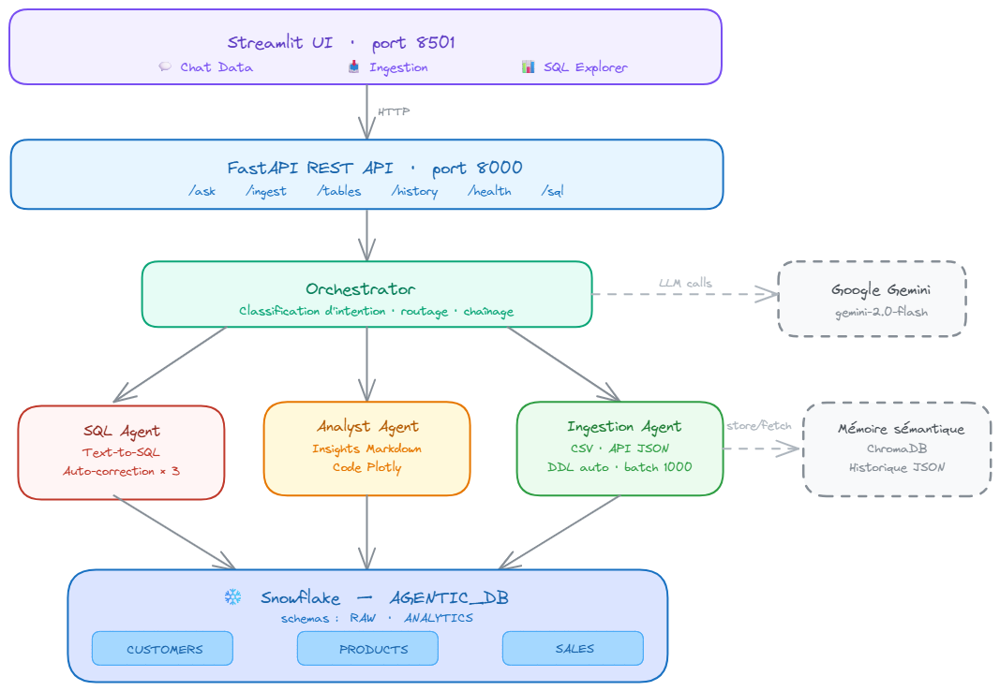

# ❄️ Snowflake Agentic AI

> Système d'agents IA autonomes connectés à Snowflake — **Text-to-SQL**, **analyse automatique**, **ingestion de données** et **orchestration multi-agents** via Google Gemini.

[](https://python.org)
[](https://fastapi.tiangolo.com)
[](https://streamlit.io)
[](https://snowflake.com)
[](https://aistudio.google.com)
[](LICENSE)

---

## Table des matières

- [Vue d'ensemble](#vue-densemble)
- [Architecture](#architecture)
- [Fonctionnalités détaillées](#fonctionnalités-détaillées)
- [Prérequis](#prérequis)
- [Installation](#installation)
- [Configuration](#configuration)
- [Setup Snowflake](#setup-snowflake)
- [Lancement](#lancement)
- [API REST — Référence complète](#api-rest--référence-complète)
- [Guide d'utilisation](#guide-dutilisation)
- [Structure du projet](#structure-du-projet)
- [Fonctionnement interne](#fonctionnement-interne)
- [Tests](#tests)
- [Dépannage](#dépannage)
- [Stack technique](#stack-technique)
- [Licence](#licence)

---

## Vue d'ensemble

**Snowflake Agentic AI** est un framework de bout en bout qui transforme un entrepôt de données Snowflake en assistant conversationnel intelligent. L'utilisateur pose une question en langage naturel — le système se charge de tout : comprendre l'intention, générer le SQL approprié, l'exécuter, corriger les erreurs automatiquement, analyser les résultats et produire des insights actionnables.

### Pourquoi ce projet ?

La plupart des outils de BI nécessitent de connaître SQL ou de naviguer dans des interfaces complexes. Ce projet supprime cette friction : n'importe qui peut interroger Snowflake en français, sans jamais écrire une ligne de SQL.

### Cas d'usage principaux

| Cas d'usage | Description |
|---|---|
| **Analyse ad hoc** | Poser des questions business complexes en langage naturel |
| **Exploration de données** | Découvrir et comprendre la structure d'une base inconnue |
| **Ingestion rapide** | Importer un CSV ou une API externe sans pipeline ETL |
| **Reporting automatique** | Générer des graphiques Plotly depuis une simple question |
| **Prototypage** | Valider rapidement des hypothèses sur les données |

---

## Architecture



### Vue en couches

Le système est organisé en **5 couches verticales** communiquant de façon synchrone, avec deux services transverses (LLM et mémoire) :

```
┌─────────────────────────────────────────────────────┐
│  Couche 1 — UI          Streamlit (port 8501)        │
├─────────────────────────────────────────────────────┤
│  Couche 2 — API         FastAPI + Uvicorn (port 8000)│
├─────────────────────────────────────────────────────┤
│  Couche 3 — Orchestration   Orchestrator             │
│             (classification d'intent via Gemini)     │
├─────────────────────────────────────────────────────┤
│  Couche 4 — Agents                                   │
│    ├── SQLAgent       (Text-to-SQL + auto-correction)│
│    ├── AnalystAgent   (Insights + code Plotly)       │
│    └── IngestionAgent (CSV / API → Snowflake)        │
├─────────────────────────────────────────────────────┤
│  Couche 5 — Data        Snowflake (AGENTIC_DB)       │
│             RAW : CUSTOMERS, PRODUCTS, SALES         │
│             ANALYTICS : SALES_SUMMARY, CUSTOMER_LTV  │
└─────────────────────────────────────────────────────┘

Services transverses :
  ← Google Gemini (gemini-2.0-flash) : LLM pour tous les agents
  ← ChromaDB : mémoire sémantique vectorielle
  ← Historique JSON : log persistant de toutes les interactions
```

### Flux de données — question en langage naturel

```
Utilisateur : "Quels sont les 5 clients avec le plus de commandes ?"
     │
     ▼
[FastAPI /ask]  ── validation Pydantic ──► body: { question, with_analysis }
     │
     ▼
[Orchestrator]  ──► Classification Gemini : intent = "sql_question"
     │
     ▼
[SQL Agent]
  1. Schéma Snowflake déjà injecté dans le system prompt (init)
  2. Reçoit la question → appelle Gemini avec le schéma + les tools disponibles
  3. Gemini génère le SQL (peut appeler get_table_schema / list_tables si besoin)
  4. Exécute le SQL sur Snowflake
  5. Si erreur → analyse l'erreur → corrige le SQL → retry (max 3)
     │
     ▼ (si with_analysis=true ou intent="analysis")
[Analyst Agent]
  6. Reçoit les résultats bruts du SQL Agent
  7. Génère des insights en Markdown
  8. Génère du code Plotly si la visualisation est pertinente
     │
     ▼
Réponse JSON : { intent, question, answer, sql, data, analysis, error }
     │
     ▼
[Streamlit UI] ── affiche tableau + graphique interactif + explication
```

---

## Fonctionnalités détaillées

### Text-to-SQL avec enrichissement de schéma

Le SQL Agent ne génère pas du SQL à l'aveugle. À l'initialisation, il récupère dynamiquement depuis Snowflake via `get_all_schemas_info()` :

- La liste des tables et vues disponibles dans les schémas `RAW` et `ANALYTICS`
- Les colonnes, types et nullabilité de chaque table

Ce contexte de schéma est injecté directement dans le system prompt Gemini. Durant l'exécution, l'agent peut aussi appeler les tools `get_table_schema` et `list_tables` pour affiner sa compréhension avant d'écrire le SQL.

### Auto-correction en boucle fermée

Si le SQL généré échoue à l'exécution, l'agent entre dans une boucle de correction :

```
Tentative 1 → Erreur Snowflake → Gemini analyse l'erreur + corrige le SQL
Tentative 2 → Erreur Snowflake → Gemini analyse l'erreur + corrige le SQL
Tentative 3 → Dernier essai   → si échec → retourne l'erreur explicite
```

L'agent analyse le message d'erreur Snowflake (colonne inconnue, type incompatible, syntaxe incorrecte, agrégation manquante, etc.) et l'utilise comme contexte additionnel pour la correction.

### Analyse IA des résultats

L'Analyst Agent prend les résultats bruts du SQL Agent et produit :

- Un **résumé en langage naturel** des chiffres clés
- La **détection de tendances** (hausses, baisses, anomalies, records)
- Des **recommandations** business actionnables basées sur les données
- Du **code Plotly** prêt à exécuter (bar chart, line chart, pie chart, scatter selon le contexte)

### Ingestion automatique de données

Le pipeline d'ingestion prend en charge deux sources :

**Source CSV local :**
```
Upload fichier CSV
     │
     ▼
load_csv_as_dataframe() → pandas DataFrame
     │
     ▼
_sanitise_columns() → noms de colonnes en UPPER_SNAKE_CASE
     │
     ▼
_generate_ddl() → inférence des types pandas → Snowflake
  (int64→NUMBER(18,0), float64→NUMBER(18,4), object→VARCHAR(500)...)
  + colonne INGESTED_AT TIMESTAMP_NTZ DEFAULT CURRENT_TIMESTAMP()
     │
     ▼
CREATE TABLE IF NOT EXISTS RAW.{TABLE_NAME}
     │
     ▼
INSERT en batches de 1000 lignes via executemany()
     │
     ▼
Rapport : {source, table, total_rows, rows_inserted, rows_failed, errors, ddl, success}
```

**Source API JSON externe :**
```
URL fournie → fetch JSON → normalisation → même pipeline à partir de l'inférence
```

### Mémoire sémantique (ChromaDB)

ChromaDB stocke chaque interaction sous forme d'embeddings vectoriels. Après chaque requête, l'orchestrateur sauvegarde la question et la réponse dans ChromaDB via `save_to_memory`. L'Analyst Agent dispose du tool `recall_memory` pour rechercher sémantiquement dans l'historique et enrichir ses analyses :

- Retrouver des contextes d'analyse similaires passés
- Produire des recommandations cohérentes avec les analyses précédentes
- Personnaliser les insights selon les patterns de la session

### Historique des interactions

Toutes les questions, SQL générés, résultats et métadonnées sont loggés dans un fichier JSON local. Accessible via l'endpoint `/history` avec pagination.

---

## Prérequis

| Prérequis | Version min. | Notes |
|---|---|---|
| **Python** | 3.11 | ⚠️ Utiliser exactement 3.11 — certaines dépendances C ne compilent pas sur 3.12+ |
| **Compte Snowflake** | Free tier | Trial 30 jours disponible sur snowflake.com |
| **Clé API Google** | — | Depuis aistudio.google.com **uniquement** (voir ci-dessous) |
| **Git** | — | Pour cloner le dépôt |

> **Important :** La clé API Google doit impérativement provenir de [aistudio.google.com](https://aistudio.google.com) et **non** de la Google Cloud Console. Seule la première donne accès au quota gratuit (15 req/min, 1 million de tokens/jour).

---

## Installation

```bash
# 1. Cloner le projet
git clone https://github.com/AkramNejj33/Snowflake-Agentic-AI.git
cd snowflake-agentic-ai

# 2. Créer l'environnement virtuel Python 3.11
py -3.11 -m venv .venv

# Windows
.venv\Scripts\activate

# macOS / Linux
source .venv/bin/activate

# 3. Installer les dépendances
pip install -r requirements.txt

# 4. Installer le projet en mode éditable (nécessaire pour les imports src.*)
pip install -e .

# 5. Copier et configurer les variables d'environnement
copy .env.example .env   # Windows
cp .env.example .env     # macOS / Linux
# → Éditer .env avec vos credentials (voir section Configuration)
```

---

## Configuration

Éditez le fichier `.env` — **ne jamais committer ce fichier**, il est dans `.gitignore`.

```env
# ── Snowflake ─────────────────────────────────────────────────────────────
SNOWFLAKE_ACCOUNT=abc12345.us-east-1   # Format : orgname-accountname
SNOWFLAKE_USER=mon_utilisateur
SNOWFLAKE_PASSWORD=mon_mot_de_passe
SNOWFLAKE_DATABASE=AGENTIC_DB
SNOWFLAKE_SCHEMA=RAW
SNOWFLAKE_WAREHOUSE=AGENTIC_WH
SNOWFLAKE_ROLE=AGENTIC_ROLE

# ── Google Gemini ─────────────────────────────────────────────────────────
# Clé depuis https://aistudio.google.com  (PAS depuis console.cloud.google.com)
GOOGLE_API_KEY=AIzaSy...
GEMINI_MODEL=gemini-2.0-flash
```

### Trouver votre SNOWFLAKE_ACCOUNT

Dans votre URL Snowflake : `https://abc12345.us-east-1.snowflakecomputing.com`

Le `SNOWFLAKE_ACCOUNT` à renseigner est : `abc12345.us-east-1`

### Obtenir une clé Google gratuite

1. Aller sur [aistudio.google.com](https://aistudio.google.com)
2. Cliquer **"Get API key"** → **"Create API key"**
3. Quota gratuit inclus : **15 requêtes/minute**, **1 million de tokens/jour**

---

## Setup Snowflake

À exécuter **une seule fois** dans Snowflake UI → **Worksheets**, connecté en tant qu'`ACCOUNTADMIN`.

### Étape 1 — Infrastructure (`infra/snowflake_setup.sql`)

Ce script crée l'ensemble de l'infrastructure nécessaire :

| Objet créé | Détail |
|---|---|
| Database | `AGENTIC_DB` |
| Schemas | `RAW` (données brutes), `ANALYTICS` (vues agrégées) |
| Warehouse | `AGENTIC_WH` — taille XS, auto-suspend 60s, auto-resume |
| Rôle | `AGENTIC_ROLE` avec toutes les permissions nécessaires |
| Tables | `CUSTOMERS`, `PRODUCTS`, `SALES` dans le schéma `RAW` |
| Vues | Vues analytiques précalculées dans `ANALYTICS` |

### Étape 2 — Données de test (`infra/sample_data.sql`)

Insère un jeu de données représentatif pour tester toutes les fonctionnalités :

- **30 clients** avec segments (Premium, Standard, Basic), villes et pays
- **25 produits** avec catégories, sous-catégories, prix, coûts et stocks
- **60 ventes** sur 6 mois avec montants, remises, canaux (online, store, phone) et statuts (completed, refunded, pending)

### Vérification post-setup

```sql
SHOW TABLES IN SCHEMA AGENTIC_DB.RAW;
SHOW VIEWS  IN SCHEMA AGENTIC_DB.ANALYTICS;
SELECT COUNT(*) FROM AGENTIC_DB.RAW.CUSTOMERS;  -- doit retourner 30
SELECT COUNT(*) FROM AGENTIC_DB.RAW.PRODUCTS;   -- doit retourner 25
SELECT COUNT(*) FROM AGENTIC_DB.RAW.SALES;      -- doit retourner 60 (dont 1 refunded)
```

---

## Lancement

Deux terminaux sont nécessaires pour faire tourner le backend et le frontend simultanément.

```bash
# Terminal 1 — API REST (backend)
py -3.11 -m uvicorn src.api.main:app --reload --port 8000

# Terminal 2 — Interface Streamlit (frontend)
py -3.11 -m streamlit run src/ui/app.py
```

| Service | URL | Description |
|---|---|---|
| **Interface utilisateur** | http://localhost:8501 | Streamlit — interface principale |
| **Documentation API** | http://localhost:8000/docs | Swagger UI interactif |
| **Documentation ReDoc** | http://localhost:8000/redoc | Documentation alternative |
| **Health check** | http://localhost:8000/health | Statut connexion Snowflake |

---

## API REST — Référence complète

### `GET /health`

Vérifie l'état de la connexion Snowflake.

```json
// 200 OK — connexion établie
{
  "status": "ok",
  "snowflake_connected": true,
  "database": "AGENTIC_DB",
  "warehouse": "AGENTIC_WH"
}

// 200 — connexion impossible (service dégradé)
{
  "status": "degraded",
  "snowflake_connected": false,
  "database": "AGENTIC_DB",
  "warehouse": "AGENTIC_WH"
}
```

---

### `POST /ask`

Point d'entrée principal — question en langage naturel vers Snowflake.

**Corps de la requête :**

```json
{
  "question": "Quels sont les 5 clients qui ont le plus dépensé ?",
  "with_analysis": false
}
```

| Champ | Type | Requis | Défaut | Description |
|---|---|---|---|---|
| `question` | string | ✅ | — | Question en langage naturel |
| `with_analysis` | boolean | ❌ | `false` | Si `true`, l'Analyst Agent génère des insights en plus du SQL |

**Réponse :**

```json
{
  "intent": "sql_question",
  "question": "Quels sont les 5 clients qui ont le plus dépensé ?",
  "answer": "Sophie Martin est la cliente la plus dépensière avec 5 999 €...",
  "sql": "SELECT c.FIRST_NAME || ' ' || c.LAST_NAME AS client, SUM(s.TOTAL_AMOUNT) AS total FROM RAW.CUSTOMERS c JOIN RAW.SALES s ON c.CUSTOMER_ID = s.CUSTOMER_ID GROUP BY 1 ORDER BY total DESC LIMIT 5",
  "data": [
    {"CLIENT": "Sophie Martin", "TOTAL": 5999.00},
    {"CLIENT": "Jade Laurent",  "TOTAL": 4528.10}
  ],
  "analysis": null,
  "error": null
}
```

---

### `POST /ingest/csv`

Upload et ingestion automatique d'un fichier CSV dans Snowflake.

```bash
curl -X POST http://localhost:8000/ingest/csv \
  -F "file=@data/clients.csv" \
  -F "table_name=CLIENTS_2024"
```

Le fichier est chargé dans le schéma `RAW` par défaut.

**Réponse :**

```json
{
  "source": "/tmp/clients.csv",
  "table": "RAW.CLIENTS_2024",
  "total_rows": 1547,
  "rows_inserted": 1547,
  "rows_failed": 0,
  "table_created": true,
  "ddl": "CREATE TABLE IF NOT EXISTS RAW.CLIENTS_2024 (\n    ID NUMBER(18,0) NULL,\n    NAME VARCHAR(500) NULL,\n    EMAIL VARCHAR(500) NULL,\n    INGESTED_AT TIMESTAMP_NTZ DEFAULT CURRENT_TIMESTAMP()\n);",
  "errors": [],
  "success": true
}
```

---

### `POST /ingest/url`

Ingestion depuis une API JSON externe.

```json
{
  "url": "https://api.exemple.com/data.json",
  "table_name": "EXTERNAL_DATA",
  "json_key": null
}
```

| Champ | Type | Requis | Description |
|---|---|---|---|
| `url` | string | ✅ | URL d'une API retournant du JSON |
| `table_name` | string | ✅ | Nom de la table cible dans le schéma `RAW` |
| `json_key` | string | ❌ | Clé JSON contenant la liste d'enregistrements (ex: `"data"`) — `null` si la racine est déjà un tableau |

---

### `GET /tables?schema=RAW`

Liste toutes les tables disponibles dans un schéma.

```json
{
  "schema": "RAW",
  "tables": ["CUSTOMERS", "PRODUCTS", "SALES", "CLIENTS_2024"]
}
```

---

### `GET /tables/{schema}/{table}/schema`

Métadonnées d'une table : colonnes, types, nullabilité et valeur par défaut.

```bash
curl http://localhost:8000/tables/RAW/CUSTOMERS/schema
```

```json
{
  "table": "CUSTOMERS",
  "schema": "RAW",
  "columns": [
    { "name": "CUSTOMER_ID", "type": "NUMBER",        "nullable": false, "default": null },
    { "name": "FIRST_NAME",  "type": "TEXT",          "nullable": false, "default": null },
    { "name": "LAST_NAME",   "type": "TEXT",          "nullable": false, "default": null },
    { "name": "EMAIL",       "type": "TEXT",          "nullable": false, "default": null },
    { "name": "PHONE",       "type": "TEXT",          "nullable": true,  "default": null },
    { "name": "CITY",        "type": "TEXT",          "nullable": true,  "default": null },
    { "name": "COUNTRY",     "type": "TEXT",          "nullable": true,  "default": "France" },
    { "name": "SEGMENT",     "type": "TEXT",          "nullable": true,  "default": null },
    { "name": "CREATED_AT",  "type": "TIMESTAMP_NTZ", "nullable": true,  "default": "CURRENT_TIMESTAMP()" }
  ]
}
```

---

### `GET /history?limit=20`

Retourne l'historique des dernières interactions.

```json
[
  {
    "id": "uuid-a1b2c3...",
    "timestamp": "2025-04-28T10:14:33+00:00",
    "agent": "sql_question",
    "question": "CA total par catégorie ?",
    "sql": "SELECT p.CATEGORY, SUM(s.TOTAL_AMOUNT) AS CA FROM RAW.SALES s JOIN RAW.PRODUCTS p ON s.PRODUCT_ID = p.PRODUCT_ID GROUP BY 1 ORDER BY CA DESC",
    "answer": "La catégorie Informatique génère le plus de CA avec 12 450 €..."
  }
]
```

Retourne une liste (au plus `limit` éléments, max 100), triée de la plus récente à la plus ancienne. L'historique est conservé sur les **200 dernières interactions** dans `data/agent_states/interaction_history.json`.

---

### `POST /sql`

Exécution SQL directe, sans passage par les agents (mode expert).

```json
{
  "query": "SELECT * FROM RAW.CUSTOMERS LIMIT 10"
}
```

**Réponse :**

```json
{
  "success": true,
  "row_count": 10,
  "rows": [{ "CUSTOMER_ID": 1, "FIRST_NAME": "Sophie", "LAST_NAME": "Martin", "EMAIL": "sophie.martin@email.fr", "SEGMENT": "Premium" }]
}
```

---

### Exemples cURL complets

```bash
# Question simple
curl -X POST http://localhost:8000/ask \
  -H "Content-Type: application/json" \
  -d '{"question": "Quels sont les 5 clients avec le plus de commandes ?", "with_analysis": false}'

# Avec analyse IA en plus
curl -X POST http://localhost:8000/ask \
  -H "Content-Type: application/json" \
  -d '{"question": "Quels sont les 5 clients avec le plus de commandes ?", "with_analysis": true}'

# Health check
curl http://localhost:8000/health

# Lister les tables du schéma RAW
curl "http://localhost:8000/tables?schema=RAW"

# Schéma détaillé d'une table
curl http://localhost:8000/tables/RAW/CUSTOMERS/schema

# Historique des 10 dernières interactions
curl "http://localhost:8000/history?limit=10"

# SQL direct
curl -X POST http://localhost:8000/sql \
  -H "Content-Type: application/json" \
  -d '{"query": "SELECT COUNT(*) FROM RAW.SALES WHERE status = '\''completed'\'''}'

# Ingestion CSV
curl -X POST http://localhost:8000/ingest/csv \
  -F "file=@mon_fichier.csv" \
  -F "table_name=MA_TABLE"
```

---

## Guide d'utilisation

### Onglet 💬 Chat Data

L'onglet principal pour interroger vos données en langage naturel.

**Analyses de ventes :**
```
Quels sont les 5 clients avec le plus de commandes ?
Quel est le CA total par catégorie de produit ?
Donne-moi l'évolution mensuelle des ventes en 2024
Quel est le produit le plus rentable (marge la plus élevée) ?
Compare les ventes du Q1 et du Q2 2024
Quel est le panier moyen par segment client ?
```

**Gestion des stocks :**
```
Quels produits ont un stock inférieur à 50 unités ?
Quels sont les produits jamais commandés ?
Liste les produits dont le stock est critique (moins de 10 unités)
```

**Analyse clients :**
```
Quels clients Premium n'ont pas commandé depuis 60 jours ?
Quelle est la répartition des clients par segment ?
Quel est le taux de rétention par segment sur 2024 ?
```

**Questions complexes :**
```
Identifie les produits dont les ventes ont baissé ce mois vs le mois dernier
Quels sont les 3 couples client-produit les plus fréquents ?
Quelle corrélation entre le segment client et le montant du panier moyen ?
```

### Onglet 📥 Ingestion

Deux modes disponibles :

**CSV local** — glissez-déposez votre fichier ou cliquez pour sélectionner. Le système lit le CSV avec le séparateur virgule par défaut, sanitise les noms de colonnes en `UPPER_SNAKE_CASE`, infère les types pandas → Snowflake, et crée la table dans le schéma `RAW`.

**API JSON** — entrez l'URL d'une API qui retourne un tableau JSON. Le système fetch, normalise et ingère automatiquement. Exemple de test : `https://jsonplaceholder.typicode.com/users`

### Onglet 📊 Explorer

Interface en deux colonnes : à gauche le sélecteur de tables avec affichage du schéma de colonnes, à droite un éditeur SQL libre pour exécuter des requêtes directement sur Snowflake. Les résultats sont téléchargeables en CSV.

---

## Structure du projet

```
snowflake-agentic-ai/
│
├── .env                        ← Variables d'environnement (gitignore !)
├── .env.example                ← Template — copier vers .env
├── .gitignore
├── CLAUDE.md                   ← Guide pour Claude Code
├── README.md                   ← Ce fichier
├── architecture.png            ← Diagramme d'architecture du système
├── requirements.txt            ← Dépendances Python avec versions fixées
├── setup.py                    ← Déclaration du package (pip install -e .)
│
├── data/                       ← Créé automatiquement au premier démarrage (gitignore)
│   ├── chroma/                 ← Base vectorielle ChromaDB (embeddings persistants)
│   │   └── chroma.sqlite3
│   └── agent_states/           ← États et historique JSON des agents
│       └── interaction_history.json  ← Log des 200 dernières interactions
│
├── infra/
│   ├── snowflake_setup.sql     ← DDL complet : database, schemas, warehouse,
│   │                             rôle, permissions, tables (CUSTOMERS, PRODUCTS,
│   │                             SALES) et vues analytiques (SALES_SUMMARY,
│   │                             CUSTOMER_LTV)
│   └── sample_data.sql         ← Données de test : 30 clients, 25 produits,
│                                 60 ventes (nov. 2024 → avr. 2025)
│
├── src/
│   ├── __init__.py
│   ├── config.py               ← Configuration via pydantic-settings
│   │                             3 sous-classes : SnowflakeSettings,
│   │                             GoogleSettings, AppSettings (extra="ignore")
│   │                             Crée data/ au démarrage, expose `settings`
│   │
│   ├── snowflake_client.py     ← Singleton Snowflake thread-safe
│   │                             Retry via tenacity (3 essais, backoff exp.)
│   │                             Méthodes : execute_query(), get_schema(),
│   │                             list_tables(), get_all_schemas_info(),
│   │                             is_healthy()
│   │
│   ├── agents/
│   │   ├── __init__.py
│   │   ├── base_agent.py       ← Classe abstraite pour tous les agents
│   │   │                         Boucle agentique Gemini (max 15 itérations)
│   │   │                         Gère : tool-calling, historique, temperature=0.1
│   │   │
│   │   ├── sql_agent.py        ← Agent Text-to-SQL
│   │   │                         Injecte le schéma Snowflake dans le system prompt
│   │   │                         Tools : execute_sql, get_table_schema, list_tables
│   │   │                         Auto-correction : jusqu'à 3 tentatives (_MAX_SQL_RETRIES)
│   │   │                         Retourne JSON : {sql, results, explanation}
│   │   │
│   │   ├── analyst_agent.py    ← Agent d'analyse des résultats
│   │   │                         Méthode publique : analyse(data, question, context)
│   │   │                         Tools : save_memory, recall_memory (ChromaDB)
│   │   │                         Génère : Markdown structuré + code Plotly
│   │   │
│   │   ├── ingestion_agent.py  ← Agent d'ingestion de données
│   │   │                         Méthodes : ingest_csv(file_path, table_name)
│   │   │                                    ingest_api(url, table_name, json_key)
│   │   │                         Pipeline : sanitise → DDL → INSERT batch 1000
│   │   │                         Retourne rapport : {source, table, rows_inserted,
│   │   │                                             rows_failed, errors, ddl, success}
│   │   │
│   │   └── orchestrator.py     ← Orchestrateur central
│   │                             Classification Gemini → Intent enum :
│   │                             sql_question / analysis / ingestion / general
│   │                             Route vers l'agent approprié, chaîne
│   │                             SQL Agent → Analyst Agent si besoin,
│   │                             Sauvegarde chaque interaction dans ChromaDB + JSON
│   │
│   ├── tools/
│   │   ├── __init__.py
│   │   ├── snowflake_tools.py  ← Tools Gemini pour le SQLAgent
│   │   │                         execute_sql(query) → JSON {success, rows, row_count}
│   │   │                         get_table_schema(table_name, schema) → JSON colonnes
│   │   │                         list_tables(schema) → JSON {schema, tables}
│   │   │                         SNOWFLAKE_TOOL_FUNCTIONS = [execute_sql,
│   │   │                                                      get_table_schema,
│   │   │                                                      list_tables]
│   │   │
│   │   ├── data_tools.py       ← Tools Gemini pour l'IngestionAgent
│   │   │                         fetch_csv(file_path, separator, encoding)
│   │   │                         call_external_api(url, method)
│   │   │                         load_csv_as_dataframe() ← usage interne uniquement
│   │   │                         DATA_TOOL_FUNCTIONS = [fetch_csv, call_external_api]
│   │   │
│   │   └── memory_tools.py     ← Tools Gemini pour l'AnalystAgent + persistance
│   │                             ChromaDB : save_memory(key, content)
│   │                                        recall_memory(query, n_results)
│   │                             JSON log : save_interaction(), load_history(limit)
│   │                             JSON state : save_agent_state(), load_agent_state()
│   │                             MEMORY_TOOL_FUNCTIONS = [save_memory, recall_memory]
│   │
│   ├── api/
│   │   ├── __init__.py
│   │   ├── main.py             ← Application FastAPI (version 0.1.0)
│   │   │                         CORS ouvert en dev (allow_origins=["*"])
│   │   │                         Lifespan : ferme la connexion Snowflake à l'arrêt
│   │   │
│   │   └── routes.py           ← Endpoints REST (voir section API)
│   │                             GET  /health
│   │                             POST /ask
│   │                             POST /ingest/csv
│   │                             POST /ingest/url
│   │                             GET  /tables
│   │                             GET  /tables/{schema}/{table}/schema
│   │                             GET  /history
│   │                             POST /sql
│   │
│   └── ui/
│       ├── __init__.py
│       └── app.py              ← Interface Streamlit
│                                 Sidebar : statut Snowflake + sélecteur de schéma
│                                 Onglet 💬 Chat Data   : chat + SQL + data + analyse
│                                 Onglet 📥 Ingestion   : CSV upload + URL API JSON
│                                 Onglet 📊 Explorer    : liste tables + éditeur SQL
│
└── tests/
    ├── __init__.py
    ├── test_snowflake.py       ← Tests d'intégration Snowflake
    │                             Nécessite .env configuré + connexion active
    │
    └── test_agents.py          ← Tests unitaires des agents
                                  Mocks Gemini et Snowflake inclus
```

---

## Fonctionnement interne

### Classification des intentions (Orchestrator)

L'orchestrateur analyse chaque message entrant et le classe en quatre catégories :

| Intent | Déclencheurs typiques | Agents activés |
|---|---|---|
| `sql_question` | Questions factuelles sur les données, stats, chiffres | SQL Agent |
| `analysis` | Insights, tendances, recommandations, analyses | SQL Agent → Analyst Agent |
| `ingestion` | Mentions de fichier, upload, importer, charger | Ingestion Agent |
| `general` | Toute autre question | Réponse directe Gemini |

### Boucle agentique Gemini (base_agent.py)

Chaque agent hérite de `BaseAgent` qui implémente la boucle suivante :

```python
for iteration in range(15):  # _MAX_ITERATIONS = 15
    response = client.models.generate_content(model, history, config)
    history.append(response.candidates[0].content)

    fc_parts = [p for p in response.parts if p.function_call]

    if not fc_parts:
        return _extract_text(response)  # fin — réponse texte finale

    # Exécuter chaque tool call et ajouter les function_response
    for part in fc_parts:
        result = self._execute_tool(part.function_call.name, dict(part.function_call.args))
        history.append(FunctionResponse(name=..., response={"result": result}))

return "[Agent] Nombre maximum d'itérations atteint sans réponse finale."
```

### Gestion thread-safe de Snowflake (snowflake_client.py)

`SnowflakeClient` est un singleton : un `threading.Lock` dans `__new__` garantit qu'une seule instance est créée même sous charge concurrente. `tenacity` ajoute le retry automatique sur les `OperationalError` (timeouts réseau) :

```python
@retry(
    retry=retry_if_exception_type(OperationalError),
    stop=stop_after_attempt(3),
    wait=wait_exponential(min=1, max=8),
)
def execute_query(self, sql: str) -> pd.DataFrame:
    self._ensure_connected()
    with self._conn.cursor(DictCursor) as cur:
        cur.execute(sql)
        rows = cur.fetchall()
        return pd.DataFrame(rows) if rows else pd.DataFrame()
```

### Enrichissement du prompt SQL

À l'instanciation, le SQL Agent appelle `get_all_schemas_info(["RAW", "ANALYTICS"])` et injecte le schéma complet dans son system prompt :

```
Tu es un expert SQL Snowflake. Utilise TOUJOURS les noms qualifiés (RAW.SALES, etc.).

SCHÉMA DISPONIBLE :
Table: RAW.CUSTOMERS
  - CUSTOMER_ID (NUMBER, NOT NULL)
  - FIRST_NAME (TEXT, NOT NULL)
  - LAST_NAME (TEXT, NOT NULL)
  - EMAIL (TEXT, NOT NULL)
  - SEGMENT (TEXT, NULL)
  - CITY (TEXT, NULL)

Table: RAW.PRODUCTS
  - PRODUCT_ID (NUMBER, NOT NULL)
  - PRODUCT_NAME (TEXT, NOT NULL)
  - CATEGORY (TEXT, NOT NULL)
  - UNIT_PRICE (NUMBER, NOT NULL)
  - STOCK_QTY (NUMBER, NULL)

Table: RAW.SALES
  - SALE_ID (NUMBER, NOT NULL)
  - CUSTOMER_ID (NUMBER, NOT NULL)
  - PRODUCT_ID (NUMBER, NOT NULL)
  - QUANTITY (NUMBER, NOT NULL)
  - TOTAL_AMOUNT (NUMBER, NOT NULL)
  - SALE_DATE (DATE, NOT NULL)
  - CHANNEL (TEXT, NULL)
  - STATUS (TEXT, NULL)

...

Retourne TOUJOURS ta réponse au format JSON : {"sql": "...", "results": [...], "explanation": "..."}
```

---

## Tests

```bash
# Tous les tests
py -3.11 -m pytest tests/ -v

# Tests unitaires uniquement (mocks inclus, pas besoin de Snowflake)
py -3.11 -m pytest tests/test_agents.py -v

# Tests d'intégration Snowflake (nécessite .env configuré)
py -3.11 -m pytest tests/test_snowflake.py -v

# Un test spécifique
py -3.11 -m pytest tests/test_agents.py::test_sql_agent_autocorrection -v

# Avec rapport de couverture
py -3.11 -m pytest tests/ --cov=src --cov-report=html
```

---

## Dépannage

### ❌ `Role 'AGENTIC_ROLE' is not granted to this user`

Le rôle n'a pas été attribué à votre utilisateur. Dans Snowflake en tant qu'`ACCOUNTADMIN` :

```sql
GRANT ROLE AGENTIC_ROLE TO USER <votre_username>;
```

---

### ❌ `429 RESOURCE_EXHAUSTED — limit: 0, model: gemini-2.0-flash`

Votre clé API provient de Google Cloud Console et non d'AI Studio. Elle n'a pas de quota gratuit.

**Solution :** Créer une nouvelle clé sur [aistudio.google.com](https://aistudio.google.com) → "Get API key" → "Create API key".

---

### ❌ `ModuleNotFoundError: No module named 'google'`

Python 3.13 est utilisé à la place de 3.11. Les packages sont installés pour Python 3.11 uniquement.

**Solution :** Utiliser `py -3.11` explicitement :

```bash
py -3.11 -m uvicorn src.api.main:app --reload --port 8000
py -3.11 -m streamlit run src/ui/app.py
```

---

### ❌ `ValidationError: Extra inputs are not permitted`

Une sous-classe `BaseSettings` ne déclare pas `"extra": "ignore"`. Le pattern utilisé dans ce projet :

```python
# Chaque sous-classe dans src/config.py
class SnowflakeSettings(BaseSettings):
    model_config = {"populate_by_name": True, "extra": "ignore", "env_file": ".env"}
```

---

### ❌ Timeouts ou `Connection reset by peer` sur Snowflake

Le warehouse s'est mis en veille (auto-suspend). Il redémarre automatiquement à la prochaine requête (délai 10-30s). Si le problème persiste :

```sql
ALTER WAREHOUSE AGENTIC_WH RESUME;
```

---

### ❌ L'interface Streamlit ne se connecte pas à l'API

Vérifier que l'API FastAPI tourne bien sur le port 8000 :

```bash
curl http://localhost:8000/health
```

Si l'API n'est pas lancée, démarrer le Terminal 1 en premier.

---

## Stack technique

| Technologie | Version | Rôle dans le projet |
|---|---|---|
| **Python** | 3.11 | Runtime — non compatible avec Python 3.12+ (dépendances C) |
| **google-genai** | 1.16.0 | SDK Google Gemini — LLM pour tous les agents |
| **snowflake-connector-python** | 4.5.0 | Connexion et exécution Snowflake |
| **chromadb** | 0.6.3 | Base vectorielle — mémoire sémantique des agents |
| **fastapi** | 0.115.6 | Framework API REST — routing, validation, docs auto |
| **uvicorn** | 0.32.1 | Serveur ASGI — exécution de l'application FastAPI |
| **streamlit** | 1.41.1 | Interface utilisateur web — 3 onglets interactifs |
| **pandas** | 2.2.3 | Manipulation des résultats et inférence de schéma CSV |
| **httpx** | 0.28.1 | Client HTTP — appels API externes dans l'IngestionAgent et l'UI |
| **python-multipart** | 0.0.20 | Upload de fichiers multipart/form-data dans FastAPI |
| **pydantic-settings** | 2.7.0 | Gestion de la configuration depuis le fichier .env |
| **python-dotenv** | 1.0.1 | Chargement automatique du fichier .env au démarrage |
| **tenacity** | 9.0.0 | Retry automatique avec backoff exponentiel |

---

## Licence

MIT — voir [LICENSE](LICENSE) pour les détails.